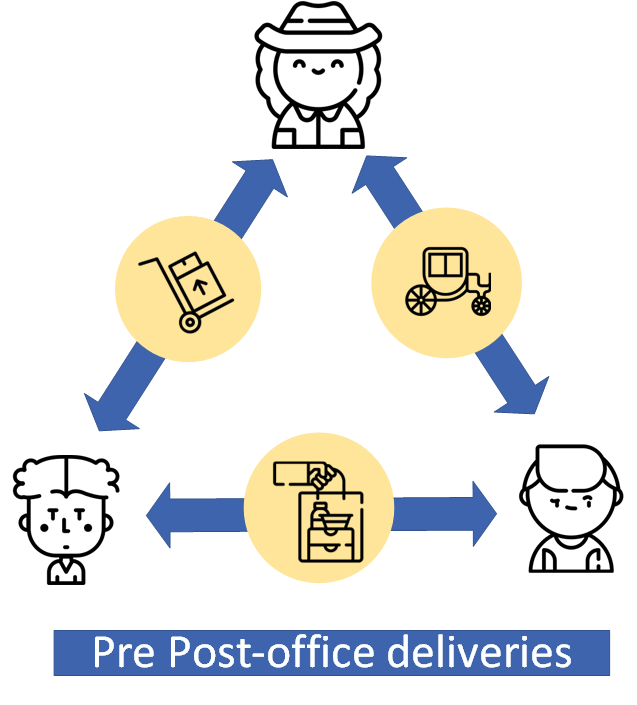
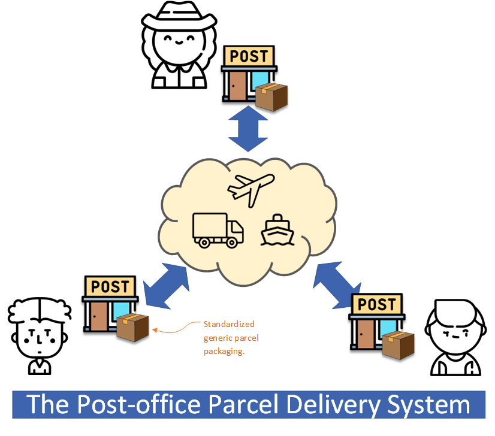
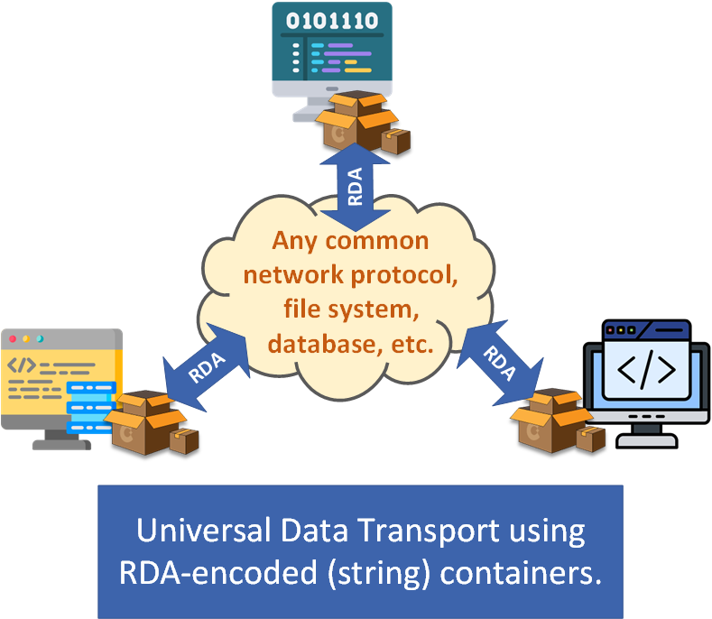

<!-- MARKDOWN LINKS & IMAGES 
[# Template from](https://github.com/othneildrew/Best-README-Template/blob/master/README.md)
-->
<!-- https://www.markdownguide.org/basic-syntax/#reference-style-links -->
[contributors-shield]: https://img.shields.io/github/contributors/foldda/charian.svg?style=for-the-badge
[contributors-url]: https://github.com/foldda/charian/graphs/contributors
[forks-shield]: https://img.shields.io/github/forks/foldda/charian.svg?style=for-the-badge
[forks-url]: https://github.com/foldda/charian/network/members
[stars-shield]: https://img.shields.io/github/stars/foldda/charian.svg?style=for-the-badge
[stars-url]: https://github.com/foldda/charian/stargazers
[issues-shield]: https://img.shields.io/github/issues/foldda/charian.svg?style=for-the-badge
[issues-url]: https://github.com/foldda/charian/issues
[license-shield]: https://img.shields.io/github/license/foldda/charian.svg?style=for-the-badge
[license-url]: https://github.com/foldda/charian/blob/master/LICENSE.txt
[product-screenshot]: images/screenshot.png
[Next.js]: https://img.shields.io/badge/next.js-000000?style=for-the-badge&logo=nextdotjs&logoColor=white
[Next-url]: https://nextjs.org/
[React.js]: https://img.shields.io/badge/React-20232A?style=for-the-badge&logo=react&logoColor=61DAFB
[React-url]: https://reactjs.org/
[Vue.js]: https://img.shields.io/badge/Vue.js-35495E?style=for-the-badge&logo=vuedotjs&logoColor=4FC08D
[Vue-url]: https://vuejs.org/
[Angular.io]: https://img.shields.io/badge/Angular-DD0031?style=for-the-badge&logo=angular&logoColor=white
[Angular-url]: https://angular.io/
[Svelte.dev]: https://img.shields.io/badge/Svelte-4A4A55?style=for-the-badge&logo=svelte&logoColor=FF3E00
[Svelte-url]: https://svelte.dev/
[Laravel.com]: https://img.shields.io/badge/Laravel-FF2D20?style=for-the-badge&logo=laravel&logoColor=white
[Laravel-url]: https://laravel.com
[Bootstrap.com]: https://img.shields.io/badge/Bootstrap-563D7C?style=for-the-badge&logo=bootstrap&logoColor=white
[Bootstrap-url]: https://getbootstrap.com
[JQuery.com]: https://img.shields.io/badge/jQuery-0769AD?style=for-the-badge&logo=jquery&logoColor=white
[JQuery-url]: https://jquery.com 


<!-- PROJECT SHIELDS -->
<!--
*** I'm using markdown "reference style" links for readability.
*** Reference links are enclosed in brackets [ ] instead of parentheses ( ).
*** See the bottom of this document for the declaration of the reference variables
*** for contributors-url, forks-url, etc. This is an optional, concise syntax you may use.
*** https://www.markdownguide.org/basic-syntax/#reference-style-links
-->
[![Contributors][contributors-shield]][contributors-url]
[![Forks][forks-shield]][forks-url]
[![Stargazers][stars-shield]][stars-url]
[![Issues][issues-shield]][issues-url]
[![MIT License][license-shield]][license-url]

<!--- PROJECT HEADER --->
# Charian 


> *Charian (pron. /ka-ri-en/) is a general-purpose data encoding API that uses the new, schemaless RDA format[^1] in the encoding. Structured data encoded in an RDA string can be easily transported using generic, non-proprietary protocols and methods, and be universally accepted for communications between independent programs.*

[^1]: RDA (Recursive Delimited Array) is a delimited text data encoding format. The encoding uses multiple delimiters, which can be dynamically defined and expanded, and provides an encoded storage space that is accessible as a multidimensional array.

<!--- TABLE OF CONTENTS --->
## Table of Contents
1. [Overview](#Overview)
    - [The problem - schema-bound data exchange](#the-problem---schema-bound-data-exchange)
    - [The idea - Universal Data Transport](#the-idea---universal-data-transport)
    - [The challenge - implementing UDT](#the-challenge---implementing-udt)
    - [The new-tech - RDA encoding](#the-new-tech---rda-encoding)
    - [The product - Charian API](#the-product---charian-api)
2. [Getting Started](#getting-started)
    - [Setup](#setup)
    - [Using the API (aka "data packing")](#using-the-api-aka-data-packing)
    - [Demo #1 - Transporting primitive data items in an RDA string](#demo-1---transporting-primitive-data-items-in-an-rda-string)
    - [Demo #2 - Serializing a simple composite data object](#demo-2---serializing-a-simple-composite-data-object)
    - [Demo #3 - Serializing a complex object with nested classes](#demo-3---serializing-a-complex-object-with-nested-classes)
    - [Other uses](#other-uses)
3. [Final Thoughts](#final-thoughts)
4. [License and Contact](#license-and-contact)
5. [Links](#links)

<!-- ABOUT THE PROJECT -->
## Overview

Available in C#, Python, and Java, Charian data-encoding can be used for implementing -

- **Persistent data storage** - for conveniently storing structured data (as strings) in files or databases;
- **Distributed computing** - for, as a hack, passing any complex data structure as a "string parameter" in a remote call;
- **Systems integration** - for exchanging data between independent programs without using dedicated middleware;
- **ETL solutions** - for transforming and transferring data of various data models through simple programming.

Charian can also be used for implementing object serialization in distributed object-oriented programs. Compared to the other object serialization systems and methods, Charien's schema-less, one-size-fits-all approach has many benefits including being -

- **Flexible**: it does not impose or depend on a fixed schema, and it can be used in programs with different or evolving data models;
- **Minimal and compact**: the API has one class and one interface, written in around 800 lines of code, with no 3rd-party dependency;
- **Easy to use**: Charian is "one size fits all" - it has no settings that require configuration;
- **Universal**: Charian-serialized objects can be exchanged cross-application, cross-language, and cross-platform[^2].

Yet, Charian is not just another data encoder or object serializer. By making cross-program data exchange much simpler and more flexible, it extends the reach where programs and devices can connect to each other and work together and gives new methods and options in developing collaborative distributed solutions.

[^2]: Subject to RDA encoder and parser availability for the language and the platform.

### The problem - schema-bound data exchange

Independent programs, such as a browser-hosted app and a Web server, or an IoT device and a control console, often need to communicate with each other in a collaborative distributed solution. Because these programs are often developed by different parties and executed on separate computer environments, exchanging data cross-program is normally more complicated and require extra effort. The conventional approach typically involves establishing an ad hoc, dedicated connection between the communicating parties, and use an ‘agreed’ data model (i.e. bound by a schema) for the data communication. 

<div align="center">

</div>

Developing a separate dedicated connection for every application that has a different data model is not cost-effective because of the duplicated effort and the high costs. It's like sending a parcel to someone without using the Post Office, instead you'd manage everything yourself - meaning you’ll have to make ad-hoc transport and delivery arrangements on each occasion, limited by the resources you have.

<div align="center">

</div>

Data exchange using schema-based connections is also inflexible. If the connected programs have different data models, or one of the programs has evolved and the data model needs to be changed, it often requires a dedicated middleware system to mediate the data model transformation. Schema-based connections make the connected programs "tightly coupled" - meaning the programs are overly dependent on each other and will incur high costs when making changes.

### The idea - Universal Data Transport

As with the Post Office, the reason it’s convenient and can save money is that the standard parcel processing service it provides suits all the different clients and the shared common logistics and freight system helps cut down the cost.

<div align="center">

</div>

Universal Data Transport, or UDT, is a proposed "post-office-like" data transport service aiming to benefit from the same approach - that is, by creating and sharing a common, generic data transport service to be shared by all programs that require exchanging data, we can avoid building ad-hoc dedicated data-exchange connections to make the operation simpler and also save money.


<div align="center">

</div>

### The challenge - implementing UDT

One “key technology” that enables the Post Office's convenient and economical service is the standard packaging, because packaging loose items in a box allows easy handling and modularized, more effective transportation from general courier companies. It's also a key to UDT to use a data container for packaging (and regulating) various data items (e.g. properties of a data object) from different clients, so irregular data can be handled uniformly using general data transport protocols and methods. 

Also, UDT is most suitable to be implemented as a messaging technology, where the data container would be a text message. That's because through data encoding, a text message can be used as a container to store data, and text (aka 'string') is one of the most supported data types by major computer systems and programming languages. If we can have a text encoding format that supports encoding **any data** into a string, we can use it to implement the UDT container. And data stored in such a container can be readily processed using generic tools and protocols, without the need for custom proprietary treatment. For example, it can be saved to a file system or a database, or be transferred via common network protocols, such as HTTP/RPC, TCP/IP, and FTP. 

Unfortunately, schema-based data formats, such as XML and JSON, are not suitable for encoding the UDT container because having a schema assumes a certain data model - meaning the container would be restricted by what data can be stored rather than being "generic and universal" that we want it to be. The more primitive CSV format also places restrictions on the intended data by having a fixed number of columns and a "header", and more importantly, CSV only allows encoding two-dimensional data - not enough for storing complex data structures. So our quest for a suitable encoding has led to the development of a new encoding data format, called RDA.

### The new-tech - RDA encoding

RDA stands for "Recursive Delimited Array". It is a delimited encoding format similar to CSV where encoded data elements are separated by delimiter chars, except for RDA it allows dynamically defining multiple delimiters for encoding more complex, multidimensional data. Below is an example of a RDA format string that contains data elements of a 2D (3x3) table, using two delimiter chars for separating the data elements.

```
|,\|A,B,C|a,b,c|1,2,3
```
The beginning of an RDA string is a substring section known as the "header" which contains the definition of the RDA string’s encoding chars including one or many delimiter chars (“delimiters”) and one escape char. In the above example, the header is the substring "|,\\|", and the delimiters are the first two chars '|' and ','. The third char ‘\\’ is the ‘escape’ char, and the last char ‘|’ is the ‘end-of-section’ marker which marks the end of the header section. Every RDA string can have a different header which means the encoding can use different encoding chars as defined in its header[^4]. 

[^4]: According to the RDA encoding rule, the header section starts from the first letter of the string and finishes at the first repeat of the string's starting letter which is called the ‘end-of-section’ marker. Any char can be used as a delimiter or the escape char, the only requirement is they must be different to each other in an RDA string header. By placing the encoding chars in the header at the front of an RDA string allows a parser to be automatically configured when it starts parsing the string.

Following the header, the remaining RDA string is the 'payload' section that contains the encoded data. The RDA payload section provides a 'virtual' storage space of a multi-dimensional array where stored data elements are delimited using the delimiters defined in the header, and each data element is accessible via an index address comprised of an array of 0-based integers. In the above example, the top dimension of the array is delimited by delimiter '|' and the second dimension is delimited by delimiter ',', and in this 2D array the data element at the location [0,1] has a string value "B".

**Compared to XML and JSON**

RDA has multi-dimensional array storage space that is dynamically expandable, that is, the size of each dimension and the number of dimensions can be increased or decreased as required, like an elastic bag. This is in contrast to the ‘fixed’ hierarchical space provided by schema-based encodings, like XML or JSON, which is restricted by a predefined data mode, like a rigid, fix-shaped box. 

RDA uses integer-based indexes for addressing the storage locations in its multi-dimensional array storage space, which means, and combination of non-negative integers is a valid address referring to a valid storage location in the space. This is in contrast to XML and JSON, the address for accessing a storage location is a ‘path’ that has to be ‘validated’ against a pre-defined schema. 

The other difference between RDA and XML/JSON is the allowed "data types". RDA has defined a very generalized data type: the value stored at a location is called a “value expression” of the referred data and such an expression can only be a string[^5]; whilst XML and JSON attempt to define and include every possible data types and a data values stored at a location must conform with what has been defined in the schema.

[^5]:  Charian encoding assumes all data (of any type) can be 'expressed as a string'. This means an RDA storage location is more tolerant for storing data, as long as the data can be converted to a string, and cunningly Charian has left its clients to bear this assumption and the responsibility of the data-type conversion.

> In an analogy, the space from XML/JSON is like a wallet, where it has places specifically defined for holding cards, notes, and coins; whilst the space from RDA is like an enormous shelf, where you can place anything at anywhere in the unlimited space that is provided.

But the most interesting and unique property of RDA is the **recursiveness** of its storage space. The multi-dimensional array structure is homogenous, and there can be only one 'unified' data type, so each sub-dimension in the space is itself a multi-dimensional space that has the same structure as its containing (parent dimension) space, and can be used in the same way. The recursiveness of the multi-dimensional space allows an arbitrarily complex data structure and its sub-components to be recursively decomposed and stored in the provided space. 

### The product - Charian API

You may find an RDA-encoded string not very friendly, especially when it contains lots of data elements and has many dimensions, and that is where the Charian API comes to play. Charian hides away the RDA encoding decoding details, and presents an intuitive, easy-to-use programming interface for a client to utilize the flexible storage features an RDA formatted string provides, and more importantly, to be able to participate in UDT. 

The Rda class and the IRda interface from the API are implemented with methods and properties for UDT-oriented operations[^6], and from a client's perspective, it only needs to deal with a simple, easy-to-access storage space, which is also serializable, through the API, it does not have to know or to deal with the RDA encoding at all.

[^6]: The description and examples are given in C# syntax, but the illustrated methods can be easily translated to the Python and Java implementations which are also provided in this repo, and have identical functions.

**Class Rda**

The Rda class implements properties and methods that are modeled as a "container" object which internally has a multidimensional storage space. Locations in the multidimensional space are accessible via integer-based indexes addresses. The Rda class provides the following Getter/Setter methods for a client to store and retrieve data items at the locations inside the space:
```
public void SetValue(string value, int[] address)
public string GetValue(int[] address)
public void SetRda(Rda rda, int[] address)
public Rda GetRda(int[] address)
```
The internal multidimensional space automatically expands to the required levels of dimension and the required size of a dimension when a location is accessed by a provided address, meaning from a client's perspective, the storage space is unlimited, and any addressed location in the space is always valid and available.

Note the API indicates only two "types of data" can be stored inside an Rda container - it must be either a 'string' value or another Rda container object. This is because Charian assumes all primitive data, like an integer or a date, can be converted to a string; and all composite data, like a class or an array, can be converted to an Rda object (as illustrated below, through recursion).

The Rda class also implements the following serialization and deserialization methods that covert itself to and from an RDA-encoded string:
```
public string ToString()
public static Rda Parse(string rdaEncodedString)
```
Data exchange using the Rda class typically would be in this sequence: the sender would 1) construct an Rda container object, 2) use the Setter methods to “pack” its data items that require transfer into the container, and 3) use the ToString method to convert the container to an RDA string which will be sent to the receiver. When the receiver has received the RDA string, it would 4) use the Parse method to convert the string back to an Rda container, then 5) use the Getter methods to "unpack" and consume the data items stored in the container.

**Interface IRda**

The IRda interface has defined two methods:
```
Rda ToRda()
IRda FromRda(Rda rda)
```
These two methods, if implemented by a class, tell a client how the class can be serialized to and deserialized from an Rda object. In data-packing terms, the ToRda() method is where to "pack" data items into a Rda container; and the FromRda() method is where to "unpack" data items from a Rda container (and to consume the retrieved data items).

The examples in the following section demonstrate how the Rda class and the IRda interface are used in storing and transporting data in UDT.

## Getting Started

Imagine we’re moving house, we would need to pack and unpack the household items from boxes before and after the move. The steps of transporting data in a UDT container are similar, except in UDT a client would be packing and unpacking data items before and after the container being transported. 

The Charian API is modeled for facilitating these analogical steps: for “packing”, a sender would use a provided container object to store and organize its data items, and serialize the container to a string using the API’s RDA encoding function, before sending the RDA-encoded string for transport; for “unpacking”, a receiver would deserialize and restore a container from a received RDA string using the RDA-decoding function from the API, and retrieve the stored data items from the container. 


### Setup

Charian has no setup or configuration or third-party dependency. Although you can build and maintain Charian as an external binary package, it's best to include Charian's source files directly  in your project so it can be compiled and built as an integral part of your program. 

### Using the API (aka “data packing”)

The following examples demonstrate some basic uses of Charian. The other good place for example usage of the API is the test cases which are included as part of the source code of this repo.

### Demo #1 - Transporting primitive data items in an RDA string

```c#
    using Charian;

    class RdaDemo1
    {
        public void Main(string[] args)
        {
            string PATH = "C:\\Temp\\file1.txt";

             //as sender ...
            SendSomeData(PATH);

            //as receiver ...
            ReceiveSomeData(PATH);
        }

        void SendSomeData(string filePath)
        {

            Rda rda1 = new Rda();    //create a new Rda container object

            //data-packing involves item placement and type-conversion
            rda1.SetValue(0, "A string");  //storing a string value at index = 0
            rda1.SetValue(1, 2.5.ToString());
            rda1.SetValue(2, DateTime.Now.ToString());

            string encodedRdaString = rda1.ToString();     //serialize

            File.WriteAllText(filePath, encodedRdaString);
        }

        void ReceiveSomeData(string filePath)
        {
            string encodedRdaString = File.ReadAllText(filePath);

            Rda rda1 = Rda.Parse(encodedRdaString);    //restore the container object from the RDA string

            //"unpacking" the data items from the container
            string a = rda1.GetValue(0);  //storing value "One" at index = 0
            double b = double.Parse(rda1.GetValue(1));
            DateTime c = DateTime.Parse(rda1.GetValue(2));
        }
    }
```

Takeaway: The sender and the receiver are expected to know where (placement) and what (types) the data items are, and handle exception if the expectation is not met.

Takeaway: Rda container has no schema and does not enforce data validation. Primitive type data are stored as strings, the client is responsible for type conversion and the associated error handling.

### Demo #2 - Serializing a simple composite data object

```C#
    public class Person : IRda
    {
        public string FirstName = "John";
        public string LastName = "Smith";

        //specify an allocated position in the RDA for storing each of the object's properties
        public enum RDA_INDEX : int
        {
            FIRST_NAME = 0,
            LAST_NAME = 1
        }

        //store the class' properties into an Rda object
        public virtual Rda ToRda()
        {
            var rda = new Rda();  //create an RDA container

            //stores each of the properties' value
            rda[(int)RDA_INDEX.FIRST_NAME].ScalarValue = this.FirstName;
            rda[(int)RDA_INDEX.LAST_NAME].ScalarValue = this.LastName;
            return rda;
        }

        //restore the class' properties from an RDA
        public virtual IRda FromRda(Rda rda)
        {
            this.FirstName = rda[(int)RDA_INDEX.FIRST_NAME].ScalarValue;
            this.LastName = rda[(int)RDA_INDEX.LAST_NAME].ScalarValue;
            return this;
        }

        //serialize and save this Person object to a file
        public void SaveToFile(string filePath)
        {
            string encodedRdaString = this.ToRda().ToString(); //serialize
            File.WriteAllText(filePath, encodedRdaString);
        }

        //restoring a Person object from an RDA string that is stored in a file
        public static Person ReadFromFile(string filePath)
        {
            string encodedRdaString = File.ReadAllText(filePath);
            Rda rda = Rda.Parse(encodedRdaString);
            Person person = new Person();
            person.FromRda(rda);
            return person;
        }
    }

```

Takeaway: The IRda interface's ToRda() and FromRda() methods are the “standard” places of a class for packing and unpacking data.

### Demo #3 - Serializing a complex object with nested classes

```C#
    class Address : IRda
    {
        public enum RDA_INDEX : int { LINES = 0, ZIP = 1 }

        public string AddressLines = "Line 1\nLine 2\nLine 3";
        public string ZIP = "NY 21540";

        //"packing" properties into an Rda container
        public Rda ToRda()
        {
            var rda = new Rda();  //create an RDA container
            // properties
            rda[(int)RDA_INDEX.LINES].ScalarValue = this.AddressLines;
            rda[(int)RDA_INDEX.ZIP].ScalarValue = this.ZIP;
            return rda;
        }

        //"unpacking" and restoring properties from an Rda container
         public IRda FromRda(Rda rda)
        {
            this.AddressLines = rda[(int)RDA_INDEX.LINES].ScalarValue;
            this.ZIP = rda[(int)RDA_INDEX.ZIP].ScalarValue;
            return this;
        }
    }

    class ComplexPerson : Person
    {
        public new enum RDA_INDEX : int
        {
            FIRST_NAME = 0,
            LAST_NAME = 1,
            RES_ADDRESS = 2,   //location of the "residential address" stored in the container
            POST_ADDRESS = 3
        }

        //extended properties of ComplexPerson
        public Address ResidentialAddress = new Address() { AddressLines = "1, 2, 3", ZIP = "12345" };
        public Address PostalAddress = new Address() { AddressLines = "a, b, c", ZIP = "23456" };

        public override Rda ToRda()
        {
            Rda personRda = base.ToRda();

            //storing an extra "address" property, as a child-Rda, inside the person's Rda container
            personRda[(int)RDA_INDEX.RES_ADDRESS] = this.ResidentialAddress.ToRda();

            //now person Rda is 2-dimensional
            //Console.Println(personRda[2][1].ScalarValue);   //prints ResidentialAddress.ZIP

            //
            //eg here we store a further “postal address” Rda to the person Rda, and so on ...
            personRda[(int)RDA_INDEX.POST_ADDRESS] = this.PostalAddress.ToRda();

            return personRda;
        }

        public override IRda FromRda(Rda rda)
        {
            //restore the base Person properties
            base.FromRda(rda);  //restores FirstName and LastName

            //de-serializing composite properties (embedded objects) recursively
            this.ResidentialAddress.FromRda(rda[(int)RDA_INDEX.RES_ADDRESS]);
            this.PostalAddress.FromRda(rda[(int)RDA_INDEX.POST_ADDRESS]);
            return this;
        }

        //retrieve a stored ComplexPerson object from a file
        public new static ComplexPerson ReadFromFile(string filePath)
        {
            string encodedRdaString = File.ReadAllText(filePath);
            Rda rda = Rda.Parse(encodedRdaString);
            ComplexPerson person = new ComplexPerson();
            person.FromRda(rda);
            return person;
        }
    }

```

Takeaway: Rda container has ‘unlimited space’ and supports recursion, which can accommodate the complexity of an evolving object to be extended indefinitely.

### Other uses

**Maintain compatibility** As illustrated in the above examples, the ComplexPerson object extends the Person object while remaining backward compatible. This means you can have a connected network where some programs work with the Person object, and some other programs have evolved and use the ComplexPerson object, and these programs will remain compatible communicating with each other in the network.

**Cross-language data exchange** Because the schemaless RDA string is language and system neutral, it can be used as a data container for flexibly transferring data cross-language and cross-platform. Without having a fixed data model, the connected programs can flexibly place and use data items stored in an RDA container during the data packing and unpacking, and to be able to flexibly handle the data conversions and any associated exceptions, in these processes.

For example, an RDA container packed by a Java program contains the properties of a Java 'Person', and these properties can be unpacked in a Python program and be used for constructing say a Python 'User' object, which may or may not have exactly the same properties as the Java Person object. If anything unexpected happens, such as an item is missing, or a data conversion has failed, the Python program can put exception handling in its 'unpacking' process e.g. sending out an alert or substituting the missing item with a default value.

**Maintaining rich and diverse data sets in parallel** Take advantage of RDA's unrestricted and recursive feature. Each Rda data item stored in a Rda container is itself an isolated container. So multiple datasets or different versions of the same dataset can be stored or sent in one container "side-by-side", and a receiver can intelligently test and pick the correct verison to use.

## Final Thoughts

UDT is a proposed universal, shareable data exchange system where exchanging data includes data packing and data transportation, using a language and system neutral data container. The data packing step allows a sender and a receiver to freely arrange the data content in the container and flexibly manage data conversion and exception-handling, and the data transportation step makes the system more economical as it allows uniformed container handling utilizing a wide range of generic tools and protocols. 

RDA is a text-encoding format developed for implementing the UDT data container in the form of text messaging. Unlike XML and JSON, RDA is schemaless and has a storage space of a multidimensional array, which has a recurring nature. 

Charian is an RDA-encoding API that is modeled around the UDT data-packing process. It includes features A client can   Data packing using Charian utilizes a container object from the API that can store arbitrarily complex data and also can be converted to and from a string. And by converting the data to string, Charian allows low-cost, easy-to-implement cross-program data exchange using the most common communication protocols and data-processing tools. 

## License and Contact

* Project Wiki

* Test cases

## Links

* [Project Wiki]

* [FAQ]

<END>

