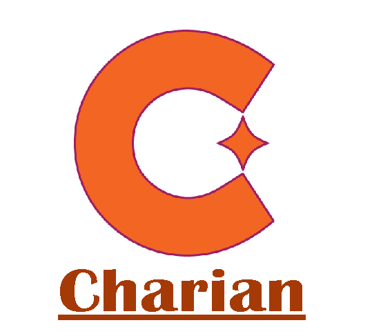
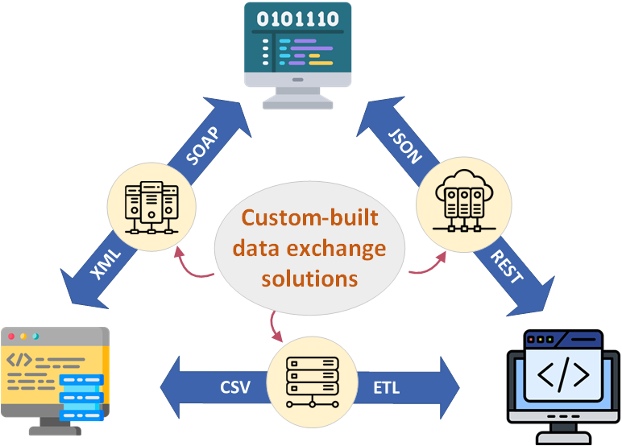
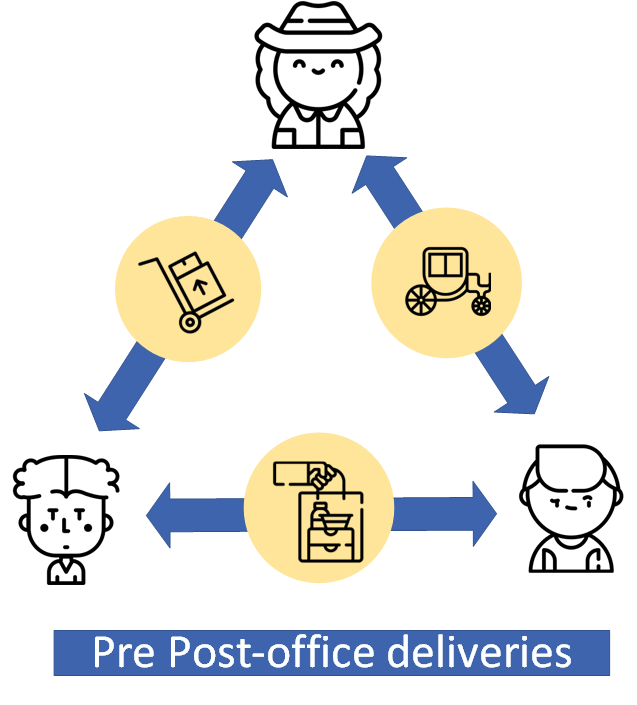
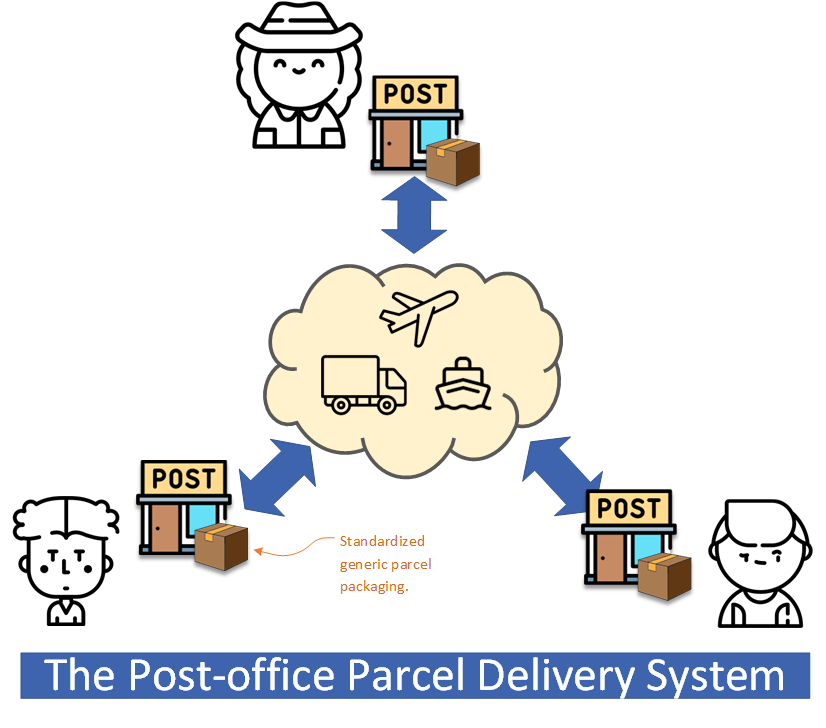
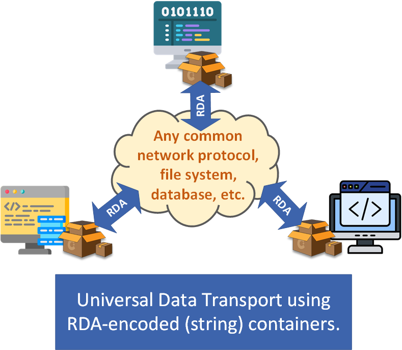

<!--- PROJECT SHIELDS --->

[![Contributors][contributors-shield]][contributors-url]
[![Forks][forks-shield]][forks-url]
[![Stargazers][stars-shield]][stars-url]
[![Issues][issues-shield]][issues-url]
[![MIT License][license-shield]][license-url]


<div align="center">


**_"Enabling data exchange between independent programs with minimum overhead and complexity."_**
</div>

<!--- TABLE OF CONTENTS --->
# Table of Contents
1. [What Is Charian](#what-is-charian)
    - [Inside the API](#inside-the-api)
    - [How does it work](#how-does-it-work)
2. [Getting Started](#getting-started)
    - [Setting up Charian](#setting-up-charian)
    - [How-to: Transporting primitive data items in an RDA string](#how-to-transporting-primitive-data-items-in-an-rda-string)
    - [How-to: Serializing a simple composite data object](#how-to-serializing-a-simple-composite-data-object)
    - [How-to: Serializing a complex object with nested classes](#how-to-serializing-a-complex-object-with-nested-classes)
    - [How-to: Exception handling](#how-to-exception-handling)
3. [Other Applicable Uses](#other-applicable-uses)
4. [License, Etc.](#license-etc)
5. [Afterword: The Big Picture](#afterword-the-big-picture)

# What Is Charian

Charian (pron. /ka-ri-en/) is a data-serialization API for encoding structured data in a formatted text string, which can be used for implementing -

- **Persistent data storage** - for conveniently storing arbitory structured data in files or databases (as strings);
- **Distributed computing** - for passing programming object or data structure (as a "string parameter") in RPC calls;
- **Data communication** - for sending complex structured data in a serialized form over the network;
- **ETL solutions** - for transferring and transforming data of various data models through simple programming.

By using the newly-developped, schemaless RDA format[^1] in its encoding, Charian provides a general-purposed serialization, meaning without any "schema change" it can be used for serializing objects of any data model. Being schemaless, Charian allows cross-program data exchange using only common data transport methods and protocols, as opposed to the conventional approaches that require dedicated custom-built pipelines that depend on pre-established data models. Charian's generic, one-size-fits-all approach gives it many advantages over the other serialization systems and methods, such as being -

[^1]: RDA (Recursive Delimited Array) is a delimited text data encoding format. The encoding uses multiple delimiters, which can be dynamically defined and expanded, and provides an encoded storage space that is accessible as a multidimensional array.

- **Simple and universal**: It is ideal for data exchange between programs with evolving and dynamic data models;
- **Minimalism**: The API is implemented with a minimal code base (of ~800 lines), with no 3rd-party dependency;
- **Easy to use**: Charian is "one size fits all" and has no settings or configuration for different situations;
- **Language and system independent**: Charian-serialized objects can be exchanged cross-language and cross-platform[^2].

[^2]: Subject to RDA encoder and parser availability for the language and the platform.

## Inside the API

Charian is a simple API that contains only two defined types: **class Rda** and **interface IRda**. It's implemented in three languages ([C#](src/CSharp), [Python](src/Python), and [Java](src/Java)) in this repo. C# syntax is used in this doco but the same concept and usage pattern are applicable to the other language implementations, as they share the same design and have a near-identical structure and naming convention. 

**Class Rda**

The Rda class is modeled as a "container" object provides a multidimensional space for storing data, where each storage location in the space is uniquely addressed by an integer array index[^3]. A client uses the following Getter/Setter methods for accessing a data item for a given address:

[^3]: The index has a dimension limit of 40 in the current implementation, and the index value for each dimension must be a non-negative integer.
```csharp
public void SetValue(string value, int[] address)     /* save a string value at the addressed location */
public string GetValue(int[] address)        /* retrieve a string value from the addressed location */
public void SetRda(Rda rda, int[] address)      /* save an Rda object at the addressed location */
public Rda GetRda(int[] address)      /* retrieve an Rda object from the addressed location */
```

Note through the API only two "data types" supported by the Rda container - a data item can be either a string or an Rda (container) object. Charian assumes all primitive data, like an integer or a date, can be converted to a string; and all composite data, like a class or an array, can be decomposed and stored inside an Rda object - as arbitrarily complex data can be recursively decomposed into less complex structures or to primitive data items (as illustrated in [this example below](#how-to-serializing-a-complex-object-with-nested-classes)).

An Rda container object is also "serializable". The Rda class implements the following methods that allow itself to be converted to and from an encoded text string in [the RDA format](#the-invention---rda-encoding):

```csharp
public string ToString()      /* convert this Rda container object to an RDA string */
public static Rda Parse(string rdaEncodedString)   /* decode the RDA string and return an Rda container object  */
```

_**Note:** From the API, class Rda offers additional methods and properties to the above-described (core) methods. Please refer to the class test cases from this repo for usage examples all the implemented features._

**Interface IRda**

The IRda interface contains the definition of two methods:
```csharp
Rda ToRda()   /* returns properties and state of this object in an Rda container object */
IRda FromRda(Rda rda) /* restores properties and state of this object from values in an Rda container */
```
A client object implements the IRda interface to indicate that itself can be converted to and from an Rda object, which in turn can be converted to an RDA-encoded string - in other words, a class implementing the IRda interface to make itself "serializable".

## How does it work

Imagine you're moving house and have various household items to be moved to a new place: the process would be first packing these items into boxes then handing them over to a courier company which will manage the transportation, and once the boxes are delivered to the new place, unpacking the boxes and placing the items to their designated places.

Exchanging data using Charian is easy to understand because the process is similar to the process of moving house, except in this case we are packing and moving data items. In this case, a data-sending client would -
1) obtain an Rda container object,
2) use the Setter methods to “pack” data items that require transfer into the container, and then
3) use the ToString method to convert the container to an RDA string.

Then, a data "courier" process takes over transporting the data container in the form of a string. Such a process can be saving the string to a file or to a database table, or sending it to a network destination via a network protocol.

A data-receiving client, upon having received the RDA string, would -
1) use the Parse method to convert the string back to an Rda container, and
2) use the Getter methods to "unpack" and consume the data items from the container.

In the above process, an Rda container plays the important role of being a 'box' for packaging data items, which also can be converted to a string for easy storage and transportation.

For object serialization, a class would implement the IRda interface: in the ToRda method it would specify the data-packing logic that stores the class' properties and the state at designated places inside an Rda container; and in the FromRda method it'd specify the logic of unpacking a received Rda container, and using the received values to restore the class properties to make the object to the intended state.

Examples of using the Rda class for storing and transporting arbitrary multiple data items in an RDA string, and using the IRda interface for implementing object serialization, are demonstrated in "How-to" examples below.

# Getting Started
Charian is very easy to use thanks to its simplicity.

## Setting up Charian
Charian has a minimal code base and has no third-party dependency. It is perfect for source-code level integration by including the provided source code files in your project and adding a reference to the API package/module/name-space in your code[^4] as it would be required by the compiler. Source-code level integration would simplify your build process and allow native code tracing in debugging if required.

[^4]: You can use the test cases provided in this repos as examples of using Charian.

## How-to: Transporting primitive data items in an RDA string
This example shows a bunch of discrete (and related) data items be bundled together and saved to a file as an RDA-encoded string. It shows a client can utilize the provided "unlimited" storage to store anything, without having to pre-define a schema. The underlying RDA-encoding is also transparent to the client.
```csharp
    using Charian;

    class RdaDemo1
    {
        public void Main(string[] args)
        {
            string PATH = "C:\\Temp\\file1.txt";

             //as sender ...
            SendSomeData(PATH);

            //as receiver ...
            ReceiveSomeData(PATH);
        }

        void SendSomeData(string filePath)
        {

            Rda rda1 = new Rda();    //create a new Rda container object

            //data-packing involves item placement and type-conversion
            rda1.SetValue(0, "A string");  //storing a string value at index = 0
            rda1.SetValue(1, 2.5.ToString());  //storing a decimal value
            rda1.SetValue(2, DateTime.Now.ToString());  //storing a date value

            string encodedRdaString = rda1.ToString();     //serialize the data container

            File.WriteAllText(filePath, encodedRdaString);  //output to a physical media
        }

        void ReceiveSomeData(string filePath)
        {
            string encodedRdaString = File.ReadAllText(filePath);  //input from a physical media

            Rda rda1 = Rda.Parse(encodedRdaString);    //restore the container object from the RDA string

            //"unpacking" the data items from the container
            string a = rda1.GetValue(0);  //retrieve the stored value ("A string") from location index = 0
            double b = double.Parse(rda1.GetValue(1));
            DateTime c = DateTime.Parse(rda1.GetValue(2));
        }
    }
```

**Takeaway**: Primitive type data are stored as strings. The sender and the receiver are expected to know where (placement) and what (types) the data items are in a container. Rda container has no schema and does not enforce data validation. The clients are responsible for type conversion and data validation, and [handle exceptions if any unexpected data is encountered](#how-to-exception-handling).

## How-to: Serializing a simple composite data object
This code example illustrates implementing object serialization by implementing the IRda interface. It includes implementing the logic of "packing" properties in the ToRda() method for serialization, and the logic of "unpacking" data in the FromRda() method for de-serialization.
```csharp
    public class Person : IRda
    {
        public string FirstName = "John";
        public string LastName = "Smith";

        //specify an allocated position in the RDA for storing each of the object's properties
        public enum RDA_INDEX : int
        {
            FIRST_NAME = 0,
            LAST_NAME = 1
        }

        //store the class' properties into an Rda object
        public virtual Rda ToRda()
        {
            var rda = new Rda();  //create an RDA container

            //stores each of the properties' value
            rda[(int)RDA_INDEX.FIRST_NAME].ScalarValue = this.FirstName;
            rda[(int)RDA_INDEX.LAST_NAME].ScalarValue = this.LastName;
            return rda;
        }

        //restore the class' properties from an RDA
        public virtual IRda FromRda(Rda rda)
        {
            this.FirstName = rda[(int)RDA_INDEX.FIRST_NAME].ScalarValue;
            this.LastName = rda[(int)RDA_INDEX.LAST_NAME].ScalarValue;
            return this;
        }

        //serialize and save this Person object to a file
        public void SaveToFile(string filePath)
        {
            string encodedRdaString = this.ToRda().ToString(); //serialize
            File.WriteAllText(filePath, encodedRdaString);
        }

        //restoring a Person object from an RDA string that is stored in a file
        public static Person ReadFromFile(string filePath)
        {
            string encodedRdaString = File.ReadAllText(filePath);
            Rda rda = Rda.Parse(encodedRdaString);
            Person person = new Person();  //an initial "empty" person object
            person.FromRda(rda);  //restores the Person's properties here.
            return person;
        }
    }

```

**Takeaway**: The IRda interface's ToRda() method is the place for a sender packing its "essential" properties and state data during serialization, and the FromRda() method is the place for a receiver unpacking a container and restore the "essential" properties and state data that "deserializes" the object. In between, the container is converted to a string for easy transportation by a 'courier' process.

## How-to: Serializing a complex object with nested classes
Because you can store an Rda object inside another Rda object, it theoretically allows an arbitrarily complex object to be stored inside an Rda container, through recurrsive decomposition. The following example extends from the last example, and shows how a ComplexPerson object with two Address properties (which are also serializable) is packed into an Rda container.
```csharp
    class Address : IRda
    {
        public enum RDA_INDEX : int { LINES = 0, ZIP = 1 }

        public string AddressLines = "Line 1\nLine 2\nLine 3";
        public string ZIP = "NY 21540";

        //"packing" properties into an Rda container
        public Rda ToRda()
        {
            var rda = new Rda();  //create an RDA container
            // properties
            rda[(int)RDA_INDEX.LINES].ScalarValue = this.AddressLines;
            rda[(int)RDA_INDEX.ZIP].ScalarValue = this.ZIP;
            return rda;
        }

        //"unpacking" and restoring properties from an Rda container
         public IRda FromRda(Rda rda)
        {
            this.AddressLines = rda[(int)RDA_INDEX.LINES].ScalarValue;
            this.ZIP = rda[(int)RDA_INDEX.ZIP].ScalarValue;
            return this;
        }
    }

    class ComplexPerson : Person
    {
        public new enum RDA_INDEX : int
        {
            FIRST_NAME = 0,
            LAST_NAME = 1,
            RES_ADDRESS = 2,   //location of the "residential address" stored in the container
            POST_ADDRESS = 3
        }

        //extended properties of ComplexPerson
        public Address ResidentialAddress = new Address() { AddressLines = "1, 2, 3", ZIP = "12345" };
        public Address PostalAddress = new Address() { AddressLines = "a, b, c", ZIP = "23456" };

        public override Rda ToRda()
        {
            Rda personRda = base.ToRda();

            //storing an extra "address" property, as a child-Rda, inside the person's Rda container
            personRda[(int)RDA_INDEX.RES_ADDRESS] = this.ResidentialAddress.ToRda();

            //now person Rda is 2-dimensional
            //Console.Println(personRda[2][1].ScalarValue);   //prints ResidentialAddress.ZIP

            //.. here we store a further “postal address” Rda to the person Rda, and so on ...
            personRda[(int)RDA_INDEX.POST_ADDRESS] = this.PostalAddress.ToRda();

            return personRda;
        }

        public override IRda FromRda(Rda rda)
        {
            //restore the base 'Person' object
            base.FromRda(rda);  //restores the FirstName and LastName properties

            //de-serialize and restore the address properties by invoking Address.FromRda()
            this.ResidentialAddress.FromRda(rda[(int)RDA_INDEX.RES_ADDRESS]);
            this.PostalAddress.FromRda(rda[(int)RDA_INDEX.POST_ADDRESS]);
            return this;
        }

        //retrieve a stored ComplexPerson object from a file
        public new static ComplexPerson ReadFromFile(string filePath)
        {
            string encodedRdaString = File.ReadAllText(filePath);
            Rda rda = Rda.Parse(encodedRdaString);
            ComplexPerson person = new ComplexPerson();
            person.FromRda(rda);
            return person;
        }
    }

```

## How-to: Exception handling
The following code expands from the last example and illustrates certain techniques that can be applied during "unpacking" and if the received data is unexpected.
```csharp

    class ComplexPerson : Person
    {
        //.....

        public override IRda FromRda(Rda rda)
        {
            try
            {
                //...
   
                //enforce mandatory residential address
                if(string.IsNullOrEmpty(rda[(int)RDA_INDEX.RES_ADDRESS]))
                {
                    throw new Exception("Missing mandatory residential address.");
                }
                else
                {
                    this.ResidentialAddress.FromRda(rda[(int)RDA_INDEX.RES_ADDRESS]);
                }

                //if the postal address is missing in the container, default to use the residential address
                if(string.IsNullOrEmpty(rda[(int)RDA_INDEX.POST_ADDRESS]))
                {
                    this.ResidentialAddress.FromRda(rda[(int)RDA_INDEX.RES_ADDRESS]);
                }
                else
                {
                    this.PostalAddress.FromRda(rda[(int)RDA_INDEX.POST_ADDRESS]);
                }
   
                //...
            }
            catch
            {
                /*
                    Anything that handles the error situation, eg -
                    1) setting a default value
                    2) escalate the error (i.e. re-throw)
                    3) return the data back to the sender, and request a re-send
                */
            }
        }
    }

```

**Takeaway**: You can implement flexible and sophisticated error handling when "unpacking" the data container.

# Other Applicable Uses

**Maintain compatibility** As illustrated in the above examples, the ComplexPerson object extends the Person object while remaining backward compatible. This means if you have a connected network where some programs work with the Person object, and some other programs have evolved and become using the ComplexPerson object, these programs will remain compatible in communicating with each other in the network.

**Cross-language data exchange** Because the schemaless RDA string is language and system-neutral, it can be used as a data container for flexibly transferring data cross-language and cross-platform. The connected programs can flexibly deposit and consume data items stored in an RDA container without being constrained by a fixed data model, and be able to flexibly handle the data conversions and any associated exceptions, in the designated data-packing and unpacking operations.

For example, an RDA container packed by a Java program contains the properties of a Java 'Person', and these properties can be unpacked in a Python program and be used for constructing say a Python 'User' object, which may or may not have exactly the same properties as the Java Person object. If anything unexpected happens, such as an item is missing, or a data conversion has failed, the Python program can put exception handling in its 'unpacking' process e.g. sending out an alert or substituting the missing item with a default value.

**Maintaining rich and diverse data sets in parallel** Take advantage of RDA's unrestricted and recursive feature. Each Rda data item stored in a Rda container is itself an isolated container. So multiple datasets or different versions of the same dataset can be stored or sent in one container "side-by-side", and a receiver can intelligently test and pick the correct version to use.

# License, Etc.

* Charian is licensed under GPL -v3

* You may contact Charian's developer by email - contact@foldda.com

**Links**

* [Project Wiki] (coming soon)

* [FAQ] (coming soon)

# Afterword: The Big Picture

Here let's talk about why we developed Charian and RDA whilst there are already many XML/JSON-based data serialization and transport solutions.

## The problem - schema-based data exchange

Independent programs, such as a browser-hosted app and a Web server, or an IoT device and a control console, often need to communicate with each other in a collaborative distributed solution. Because these programs are often developed by different parties and executed on separate computer environments, exchanging data between them is normally complicated and requires extra effort. The conventional approach to cross-program data exchange typically involves building an ad hoc, dedicated connection between the communicating parties, based on an ‘agreed’ data model (i.e. a schema).

<div align='center'>

</div>

Developing a dedicated connection for every application that has a different data model is not cost-effective because of the duplicated effort and the high costs. The cost of managing data exchange over schema-based connections can also be significant because the connected programs become “tightly coupled” by these connections. If one of the programs has evolved and the data model needs to be changed, a developed solution often requires significant modification or using a dedicated middleware system to mediate the data model transformation.

In an analogy, building ad-hoc schema-bound data exchange solutions is like sending parcels to people without using the Post Office, but doing everything yourself - meaning you’ll have to make ad-hoc transport and delivery arrangements on each occasion, limited by the resources you have.

<div align='center'>

</div>

## The solution and the challenge - universal data transport

As we know, using the Post Office is convenient and cost-effective because the standard parcel processing meets the various requirements of its clients, such as posting of goods of different shapes and sizes, and the shared, common logistics and freight system helps cut down the cost.

<div align='center'>

</div>

Universal Data Transport, or UDT, is a proposed data transport service that provides the benefits of being convenient and cost-effective using the same “post-office-like” approach - that is, by creating and sharing a common, generic data transport service to be shared by all programs that require exchanging data, rather than building ad-hoc dedicated data-exchange connections.

<div align='center'>

</div>

As mentioned, the Post Office's parcel-processing service must cater to the different parcel-posting requirements of all its clients, and the answer is to use standardized packaging. Packaging loose items in boxes simplifies parcel handling and allows modularized, more effective transportation that can be carried out by a general courier company. Similarly, a key in UDT's design is to use a generic data container for packaging (and regulating) various data items (e.g. properties of a data object), so irregular data can be handled uniformly using general data transport protocols and methods.

Also, UDT is most suitable to be implemented as a messaging technology, where the data container is an encoded text message. That’s because through data encoding, a text message can be used as a container to store data, and text (i.e. ‘string’) is one of the most supported data types by major computer systems and programming languages. Data stored in a “string container” can be readily processed using generic tools and protocols, without the need for any custom proprietary treatment. For example, it can be saved to a file system or a database, or be transferred via common network protocols, such as HTTP/RPC, TCP/IP, and FTP. Thus the challenge to implementing UDT is to have a text encoding format that supports encoding any data into a string.

Unfortunately, popular data formats, such as XML, JSON and CSV, are not suitable for encoding the UDT container. That’s because each data instance in one of these formats assumes a certain data model (by structure and type), meaning a container encoded in these formats won't be the “generic and universal” that we want for accommodating _any data_. So our quest for a suitable encoding has led to the development of RDA - a new schemaless data format.

## The invention - RDA encoding

RDA stands for "Recursive Delimited Array". It is a delimited encoding format similar to CSV where encoded data elements are separated by delimiter chars. Below is an example of a RDA format string that contains data elements of a 2D (3x3) table, using two delimiter chars for separating the data elements.

```
|,\|A,B,C|a,b,c|1,2,3
```
The beginning of an RDA string is a substring section known as the "header" which contains the definition of the RDA string’s encoding chars including one or many delimiter chars (“delimiters”) and one escape char. In the above example, the header is the substring "|,\\|", and the delimiters are the first two chars '|' and ','. The third char ‘\\’ is the ‘escape’ char, and the last char ‘|’ is the ‘end-of-section’ marker which marks the end of the header section. The header structure allows dynamically defining multiple delimiters for encoding more complex, multidimensional data, which also means every RDA string can use a different set of chars for its encoding[^4].

[^4]: According to the RDA encoding rule, the header section starts from the first letter of the string and finishes at the first repeat of the string's starting letter which is called the ‘end-of-section’ marker. Any char can be used as a delimiter or the escape char, the only requirement is they must be different to each other in an RDA string header. By placing the encoding chars in the header at the front of an RDA string allows a parser to be automatically configured when it starts parsing the string.

Following the header, the remaining RDA string is the 'payload' section that contains the encoded data. The RDA payload section provides a 'virtual' storage space of a multi-dimensional array where stored data elements are delimited using the delimiters defined in the header, and each data element is accessible via an index address comprised of an array of 0-based integers. In the above example, the top dimension of the array is delimited by delimiter '|' and the second dimension is delimited by delimiter ',', and in this 2D array the data element at the location [0,1] has a string value "B".

**Compared to XML and JSON**

> The space from XML/JSON is like a wallet, where it has places specifically defined for holding cards, notes, and coins; whilst the space from RDA is like an enormous shelf, where you can place anything anywhere in the unlimited space that is provided.

RDA is specifically designed to avoid targeting a certain data model and having to define and maintain a schema. Such design is reflected by the structure of RDA's encoded storage space, the way of addressing a location in the space, and the supported data types[^5].  

[^5]: First, RDA has multi-dimensional array storage space that is dynamically expandable, that is, the size of each dimension and the number of dimensions can be increased or decreased as required, like an elastic bag. This is in contrast to the ‘fixed’ hierarchical space provided by schema-based encodings, like XML or JSON, which is restricted by a predefined data mode, like a rigid, fixed-shaped box. Second, RDA uses integer-based indexes for addressing the storage locations in its multi-dimensional array storage space, which means, and combination of non-negative integers is a valid address referring to a valid storage location in the space. This is in contrast to XML and JSON, the address for accessing a storage location is a ‘path’ that has to be ‘validated’ against a pre-defined schema. Third, RDA assumes all data (of any type) can be 'expressed as a string' and a value stored at a location (referred to as “a data's value expression”) can only be a string; whilst XML and JSON attempt to define and include every possible data types and a data values stored at a location must conform with what has been defined in the schema.

Inheritively from RDA's schemaless design, the encoding is simpler, more space-efficient, and configuration-free compared to XML and JSON. But perhaps the most interesting and unique property of RDA is the **recursiveness** of the storage space: the multi-dimensional array structure is homogenous, and there can be only one 'unified' data type, so a sub-dimension in the space is itself a multi-dimensional space that has the same structure as its containing (parent dimension) space, and can be used in the same way. The recursiveness of the multi-dimensional space allows an arbitrarily complex data structure to be (recursively) decomposed into sub-components and stored in the dimensions and their sub-dimensions from the provided space.

## The product - Charian

Backed by the RDA encoding, the **Rda class** and the **IRda interface** from Charian API are designed to make the UDT operations simple, intuitive, and practical[^6]. For object serialization, a client only needs to use a provided storage space (modeled as a simple container object) in the "data packing" process, without having to pre-establish and maintain a rigid data model or a schema.

[^6]: The description and examples are given in C# syntax, but the illustrated methods can be easily translated to the Python and Java implementations which are also provided in this repo, and have identical functions.

Yet, Charian is not just another data encoder or object serializer. By making cross-program data exchange much simpler and more flexible, Charian allows for building a "post-office-like" data transport eco-system through which more programs and devices can connect and work collaboratively like never before. Charian is a technology building block that inspires brand-new ways of developing creative distributed systems and solutions.

<!--- MARKDOWN LINKS & IMAGES
[# Template from](https://github.com/othneildrew/Best-README-Template/blob/master/README.md)
--->
<!--- https://www.markdownguide.org/basic-syntax/#reference-style-links --->
[contributors-shield]: https://img.shields.io/github/contributors/foldda/charian.svg?style=for-the-badge
[contributors-url]: https://github.com/foldda/charian/graphs/contributors
[forks-shield]: https://img.shields.io/github/forks/foldda/charian.svg?style=for-the-badge
[forks-url]: https://github.com/foldda/charian/network/members
[stars-shield]: https://img.shields.io/github/stars/foldda/charian.svg?style=for-the-badge
[stars-url]: https://github.com/foldda/charian/stargazers
[issues-shield]: https://img.shields.io/github/issues/foldda/charian.svg?style=for-the-badge
[issues-url]: https://github.com/foldda/charian/issues
[license-shield]: https://img.shields.io/github/license/foldda/charian.svg?style=for-the-badge
[license-url]: https://github.com/foldda/charian/blob/master/LICENSE.txt
[product-screenshot]: images/screenshot.png
