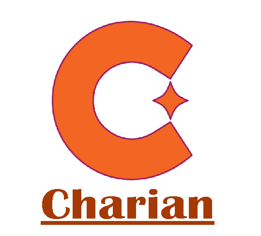

<!--- PROJECT SHIELDS --->

[![Contributors][contributors-shield]][contributors-url]
[![Forks][forks-shield]][forks-url]
[![Stargazers][stars-shield]][stars-url]
[![Issues][issues-shield]][issues-url]
[![GPL v3 License][license-shield]][license-url]


<div align="center">


**_"Cross-program data exchange without schema management."_**
</div>

<!--- TABLE OF CONTENTS --->
# Table of Contents
1. [Introduction](#introduction)
    - [A simple example](#a-simple-example)
    - [Compared to Protobuf / Avro / JSON Schema](#compared-to-protobuf--avro--json-schema)
2. [Getting Started](#getting-started)
    - [Installation]
    - [Example: exchanging a simple data object](#how-to-serializing-a-simple-composite-data-object)
3. [Inside The API]()
    - [Concept: serialization by late-binding](#late-binding)
    - [Rda & IRda]
    - [Example: encoding primitive data items into an RDA string](#how-to-transporting-primitive-data-items-in-an-rda-string)
4. [More Code Examples]
    - [How-to: Serializing a complex object with nested classes](#how-to-serializing-a-complex-object-with-nested-classes)
    - [How-to: Exception handling](#how-to-exception-handling)
5. [Advantegous Use Cases](#use-cases, vision of UDX)
6. [License](#license--commercial-use)

# Introduction

**Charian** (pron. /ka-ri-en/) is a lightweight, dependency-free serialization library for applications whose data models evolve independently.

Unlike Protocol Buffers, Avro, or JSON Schema, Charian requires **no schema definitions**, **no code generation**, and **no schema version management**. Instead, applications explicitly control how they pack and unpack data, making long-lived integrations more resilient to change.

Charian is particularly suited to:

* Evolving Enterprise integration and interfaces
* Cross-language, cross-platform communication
* Lightweight RPC for distributed applications
* Systems where data models evolve independently or are outside your control

Built on the [**Recursive Delimited Array (RDA)**](https://github.com/foldda/rda) format, Charian serializes arbitrary object structures into a portable, language-independent text representation while remaining small enough to understand completely—its core implementation is approximately 800 lines of code with zero third-party dependencies.

### A simple example

```csharp
Person person = new Person("John", "Smith");

// [Sender] Serialize ...
string text = person.ToRda().ToString();

// [Receiver] Deserialize ...
Person restored = new Person();
restored.FromRda(Rda.Parse(text));
```

That's all it takes.

No schema files.

No code generation.

No serialization attributes.

Just explicit, application-controlled serialization that remains robust as your software evolves.

### Compared To Protobuf / Avro / JSON Schema

Protobuf, Avro, and JSON Schema all solve data exchange by fixing a schema up front and generating code from it. That works well when both sides of a connection are owned by the same team and evolve together. Charian takes a different approach: it skips the schema entirely, so there's nothing to keep in sync in the first place.

The core difference is **tight coupling vs. loose coupling**. Protobuf and Avro require both sides of a connection to share a schema — that shared contract is what enables their compactness and compile-time validation, but it also means both sides must stay synchronized as the data model changes. Charian removes the shared schema entirely, trading those benefits for structural independence between systems that don't evolve together.

| | Protobuf / Avro / JSON Schema | Charian |
|---|---|---|
| **Contract** | Schema defined up front; both sides must agree on it | No schema; each side reads/writes by position, independently |
| **Schema drift** | A field added, removed, or retyped on one side can break the other unless versioning rules are followed carefully | Structure changes on one side don't break the other — the receiver only reads what it expects and handles the rest itself |
| **Setup** | Requires a schema file (`.proto`, `.avsc`, etc.) and a code-generation step | No schema file, no codegen — just two source files added to your project |
| **Tooling footprint** | Compiler/codegen toolchain, schema registry (for Avro), versioning discipline | None — ~800 lines, no 3rd-party dependency |
| **Validation** | Strong compile-time type safety and schema enforcement, made possible by the shared contract | None — validation and error handling are the client's responsibility |
| **Payload size** | Compact binary for Protobuf/Avro; the shared schema lets field names and type tags be stripped from the wire | Delimited text string, larger than Protobuf/Avro's binary but more compact than JSON |
| **Best fit** | Stable, high-throughput systems within a single team's control (internal microservices, high-volume event streams) | Systems integration across teams, vendors, or legacy platforms where data models are inconsistent, evolving, or outside your control |

Charian is aimed at the specific pain point of **integration between systems you don't fully control** — connecting a legacy system to a modern one, exchanging data with a third-party vendor, or maintaining a pipeline where the data model on either end changes independently and without warning. In these situations, a shared schema becomes a liability: every change on one side risks a synchronized (and often coordinated, multi-team) update on the other, or the pipeline breaks.

Because of late-binding, Charian allows flexible handling of data's schema changes, even processing data of multiple schema versions conncurrently and dynamically. This trades the schema's built-in validation for structural independence — a fair trade when the alternative is fragile, tightly-coupled pipelines between systems that were never designed to evolve together.

In summary, choose **Charian** when:

* Your applications evolve independently.
* You integrate with third-party or legacy systems.
* Maintaining shared, or multiple versions of, schemas has become difficult.
* Cross-language compatibility matters.
* You prefer explicit serialization logic over generated code.

Choose **Protocol Buffers**, **Avro**, or similar technologies when:

* You own both ends of the communication.
* Maximum throughput is more important than flexibility.
* Compile-time schema validation is desirable.


## Under construction ...

Foldda Charian (pron. /ka-ri-en/) is a lightweight and universal data serialization API for converting structured data objects to and from encoded text strings. It can be used for implementing -

- **Persistent data storage** - for storing arbitrarily structured data in files or databases as a string;
- **Distributed computing** - for passing dynamic objects or data structures in RPC calls as a "string parameter";
- **Data communication** - for sending complex structured data in a serialized form over the network;
- **Integration and ETL solutions** - for transferring data of changing data models across applications via simple, static pipelines.

Charian serialization uses a schemaless text-encoding format called "Recursive Delimited Array" ( RDA)[^1] that enocdes anything and everything to one generic data model, which is a multidimensional array. Its one-size-fits-all approach, compared to traditional schema-based serialization tools and systems, has many advantages -

[^1]: RDA (Recursive Delimited Array) is a delimited text data encoding format that uses multiple delimiters that can be dynamically defined and expanded. An RDA-encoded string provides an encoded storage space accessible as a multidimensional array.

- **Simple and universal**: It is ideal for data exchange between programs with evolving and dynamic data models;
- **Minimalism and lightweight**: The API is implemented with a minimal code base (of ~800 lines), with no 3rd-party dependency;
- **Easy to use**: Charian is "one size fits all" - it has no settings or configuration;
- **Language and system independent**: Charian-serialized objects can be exchanged cross-language and cross-platform[^2].

[^2]: Subject to RDA encoder and parser availability for the language and the platform.

Charian serialization allows flexible cross-program data exchange via generic data exchange methods and protocols, meaning much simpler and more efficient data communication between collaborative programs than the traditional approach of building and maintaining ad-hoc, data-model-dependent pipelines. Indeed, Charian is a technology that opens the door for [*universal data exchange*](https://github.com/foldda/RDA/tree/main#the-problem-to-addres). 

In this repo, Charian API is implemented in [C#](src/CSharp), [Python](src/Python), and [Java](src/Java). These implementations are clones of each other, meaning they share a near-identical programming design/structure/naming convention. Below, we'll use the C# API as an example to explain Charian's concept and usage pattern. 

## Inside the API

The C# API contains only two object types: **class Rda** and **interface IRda**. 

**Class Rda**

The Rda class is modeled as a "container" object for storing data. It has a multidimensional space where each storage location in the space is uniquely addressed by an integer array index[^3]. A client uses the following Getter/Setter methods for accessing a data item in the space for a given address:

[^3]: The index has a dimension limit of 40 in the current implementation, and the index value for each dimension must be a non-negative integer.
```csharp
public void SetValue(string value, int[] address)     /* save a string value at the addressed location */
public string GetValue(int[] address)        /* retrieve a string value from the addressed location */
public void SetRda(Rda rda, int[] address)      /* save an Rda object at the addressed location */
public Rda GetRda(int[] address)      /* retrieve an Rda object from the addressed location */
```

An Rda container supports storing only two "data types" - a data item can be either a string or an Rda (container) object. Charian assumes all primitive data, like an integer or a date, can be converted to a string and all composite data, like a class or an array, can be stored as an Rda object (by recursively decomposing the data object to less complex structures or primitive data items, as in [this example below](#how-to-serializing-a-complex-object-with-nested-classes)).

In addition, the Rda class implements the following methods that converts itself to and from an [RDA string](https://github.com/foldda/rda), so it can be used as a generic RDA parser/encoder:

```csharp
public string ToString()      /* convert this Rda container object to an RDA string */
public static Rda Parse(string rdaEncodedString)   /* decode the RDA string and return an Rda container object  */
```

_**Note:** From the API, class Rda offers additional methods and properties to the above-described (core) methods. Please refer to the class test cases from this repo for usage examples of all the implemented features._

**Interface IRda**

The IRda interface defines two methods:

```csharp
Rda ToRda()   /* returns properties and state of this object in an Rda container object */
IRda FromRda(Rda rda) /* restores properties and state of this object from values in an Rda container */
```

A class implements the IRda interface to mark itself "serializable", in the Charian way ...

## How does it work

Imagine you're moving house: you would first pack household items into boxes, disassemble them if required, and then transport the boxes using a courier company. Once the boxes are delivered to the new place, you would unpack the boxes, reassemble the items, and re-place them to their designated places.

Similar to moving house, serializing data using Charian involves (data) packing, transporting, and unpacking. That is, a program sending a "whole" data object would -

1) create an Rda object and use it as a container,
2) use the **Setter** methods to “pack” data items that require transfer into the container, and then
3) use the **ToString** method to convert the container to an RDA string.

Then, a data "courier" process takes over transporting the data container - a string. It can be saving the string to a file or a database table, or sending it to a network destination via a network protocol.

At the other end, a data-receiving program would deserialize the RDA string and re-assemble the data object -

1) use the **Parse** method to convert the string back to an Rda container, and
2) use the **Getter** methods to "unpack" and consume the data items from the container.

In the above process, the Rda class plays the important role of being a generic and flexible 'container box' for packing and unpacking data items, as it can accommodate any data object with arbitrary volume and complexity. Also, because an Rda container can be turned into a string, it effectively serializes the data it contains.

Implementing the IRda interface marks a class as capable of Rda-based serialization and deserialization: the **ToRda** method is where to specify the data-packing logic that stores the class's properties and state at designated places in an Rda container, and the **FromRda** method implements the logic of unpacking a received Rda container and restoring the object's properties and state.

The "how-to" examples in the next section demonstrate the uses of these concepts and operations.

## Why Charian?


# Getting Started

You can start using Charian in your project in one of two ways: **install it as a package** (recommended for most users), or **include the source files directly** (useful if you want source-level transparency, need to target a framework not covered by the package, or prefer to avoid an external dependency).

### Option 1: Install via package manager

**C# (NuGet)**

```
dotnet add package Foldda.Charian
```

Or via the Package Manager Console:

```
Install-Package Foldda.Charian
```

Or add it directly to your `.csproj`:

```xml
<PackageReference Include="Foldda.Charian" Version="1.0.1" />
```

The package targets .NET 5.0, .NET Core 2.0, .NET Standard 2.0, and .NET Framework 4.6.1, so it should be compatible with most existing C# projects. View the package on [NuGet.org](https://www.nuget.org/packages/Foldda.Charian).

**Python / Java**

Python and Java packages are not yet published to PyPI or Maven Central. For now, use the source-inclusion method below for these languages.

### Option 2: Include the source files directly

Charian has no third-party dependencies, so integrating it is as simple as downloading two source files from this repo and adding them to your project. This approach simplifies your build process and gives you full transparency during debugging, when needed.

1. Download the source files for your language from this repo:
   - [C#](https://github.com/foldda/charian/blob/main/src/CSharp)
   - [Java](https://github.com/foldda/charian/blob/main/src/Java)
   - [Python](https://github.com/foldda/charian/blob/main/src/Python)
2. Add the files to your project.
3. Reference them as you would any other local source file — no additional configuration is required.

> **Tip:** You can use the test cases in this repo as examples of how to use Charian.

## How-to: Transporting primitive data items in an RDA string

This example groups a collection of discrete data items and saves them to a file as an RDA-encoded string. The program uses the provided "unrestricted" storage to hold arbitrarily structured data (here, the structure is sequential) without needing to predefine a schema. Note that the underlying RDA encoding is transparent to the client throughout.

```csharp
using Charian;

class RdaDemo1
{
    public void Main(string[] args)
    {
        //a file is used as the physical media/channel for the data transport
        string PATH = "C:\\Temp\\file1.txt";

        //as sender ...
        SendSomeData(PATH);

        //as receiver ...
        ReceiveSomeData(PATH);
    }

    void SendSomeData(string filePath)
    {

        Rda rda1 = new Rda();    //create a new Rda container object

        //data-packing involves item placement and type-conversion
        rda1.SetValue(0, "A string");  //storing a string value at index = 0
        rda1.SetValue(1, 2.5.ToString());  //storing a decimal value
        rda1.SetValue(2, DateTime.Now.ToString());  //storing a date value

        string encodedRdaString = rda1.ToString();     //serialize the data container

        File.WriteAllText(filePath, encodedRdaString);  //output to a physical media
    }

    void ReceiveSomeData(string filePath)
    {
        string encodedRdaString = File.ReadAllText(filePath);  //input from a physical media

        Rda rda1 = Rda.Parse(encodedRdaString);    //restore the container object from the RDA string

        //"unpacking" the data items from the container
        string a = rda1.GetValue(0);  //retrieve the stored value ("A string") from location index = 0
        double b = double.Parse(rda1.GetValue(1));
        DateTime c = DateTime.Parse(rda1.GetValue(2));
    }
}
```

**Takeaway**: Primitive data is stored as strings. The sender and receiver are each expected to know where (placement) and what (type) the data items are within a container. The Rda container has no schema and performs no data validation — clients are responsible for type conversion and validation, and for [handling exceptions if unexpected data is encountered](#how-to-exception-handling).

## How-to: Serializing a simple composite data object

This example shows how to serialize a `Person` class that implements the `IRda` interface. The `Person` class implements the "packing" logic in `ToRda()` and the "unpacking" logic in `FromRda()`. These methods hide the class's internal data model, letting a client serialize and deserialize with simple calls, similar to the `SaveToFile()` and `ReadFromFile()` methods shown below.

```csharp
public class Person : IRda
{
    public string FirstName = "John";
    public string LastName = "Smith";

    //specify an allocated position in the RDA for storing each of the object's properties
    public enum RDA_INDEX : int
    {
        FIRST_NAME = 0,
        LAST_NAME = 1
    }

    //store the class's properties into an Rda object
    public virtual Rda ToRda()
    {
        var rda = new Rda();  //create an RDA container

        //stores each of the properties' value
        rda[(int)RDA_INDEX.FIRST_NAME].ScalarValue = this.FirstName;
        rda[(int)RDA_INDEX.LAST_NAME].ScalarValue = this.LastName;
        return rda;
    }

    //restore the class's properties from an RDA
    public virtual IRda FromRda(Rda rda)
    {
        this.FirstName = rda[(int)RDA_INDEX.FIRST_NAME].ScalarValue;
        this.LastName = rda[(int)RDA_INDEX.LAST_NAME].ScalarValue;
        return this;
    }

    //client calls this method to serialize and save this Person object to a file
    public void SaveToFile(string filePath)
    {
        string encodedRdaString = this.ToRda().ToString(); //serialize
        File.WriteAllText(filePath, encodedRdaString);
    }

    //client calls this method to restore a Person object from an RDA string read from a file
    public static Person ReadFromFile(string filePath)
    {
        string encodedRdaString = File.ReadAllText(filePath);
        Rda rda = Rda.Parse(encodedRdaString);
        Person person = new Person();  //an initial "empty" person object
        person.FromRda(rda);  //restores the Person's properties here.
        return person;
    }
}
```

**Takeaway**: `ToRda()` is where a sender packs its essential properties and state during serialization, and `FromRda()` is where a receiver unpacks a container and restores that essential state during deserialization. In between, the container is converted to a string for easy transport by a "courier" process. Conventional serialization systems typically decompose and serialize an object in its entirety, which adds overhead that isn't always necessary.

## How-to: Serializing a complex object with nested classes

Because an Rda object can store another Rda object, any arbitrarily complex object can, in principle, be stored inside a single Rda container through recursive decomposition. The following example builds on the last one, showing how a `ComplexPerson` object with two `Address` properties (themselves serializable) is packed into an Rda container.

```csharp
class Address : IRda
{
    public enum RDA_INDEX : int { LINES = 0, ZIP = 1 }

    public string AddressLines = "Line 1\nLine 2\nLine 3";
    public string ZIP = "NY 21540";

    //"packing" properties into an Rda container
    public Rda ToRda()
    {
        var rda = new Rda();  //create an RDA container
        // properties
        rda[(int)RDA_INDEX.LINES].ScalarValue = this.AddressLines;
        rda[(int)RDA_INDEX.ZIP].ScalarValue = this.ZIP;
        return rda;
    }

    //"unpacking" and restoring properties from an Rda container
    public IRda FromRda(Rda rda)
    {
        this.AddressLines = rda[(int)RDA_INDEX.LINES].ScalarValue;
        this.ZIP = rda[(int)RDA_INDEX.ZIP].ScalarValue;
        return this;
    }
}

class ComplexPerson : Person
{
    public new enum RDA_INDEX : int
    {
        FIRST_NAME = 0,
        LAST_NAME = 1,
        RES_ADDRESS = 2,   //location of the "residential address" stored in the container
        POST_ADDRESS = 3
    }

    //extended properties of ComplexPerson
    public Address ResidentialAddress = new Address() { AddressLines = "1, 2, 3", ZIP = "12345" };
    public Address PostalAddress = new Address() { AddressLines = "a, b, c", ZIP = "23456" };

    public override Rda ToRda()
    {
        Rda personRda = base.ToRda();

        //storing an extra "address" property, as a child-Rda, inside the person's Rda container
        personRda[(int)RDA_INDEX.RES_ADDRESS] = this.ResidentialAddress.ToRda();

        //now person Rda is 2-dimensional
        //Console.Println(personRda[2][1].ScalarValue);   //prints ResidentialAddress.ZIP

        //.. here we store a further “postal address” Rda to the person Rda, and so on ...
        personRda[(int)RDA_INDEX.POST_ADDRESS] = this.PostalAddress.ToRda();

        return personRda;
    }

    public override IRda FromRda(Rda rda)
    {
        //restore the base 'Person' object
        base.FromRda(rda);  //restores the FirstName and LastName properties

        //de-serialize and restore the address properties by invoking Address.FromRda()
        this.ResidentialAddress.FromRda(rda[(int)RDA_INDEX.RES_ADDRESS]);
        this.PostalAddress.FromRda(rda[(int)RDA_INDEX.POST_ADDRESS]);
        return this;
    }

    //retrieve a stored ComplexPerson object from a file
    public new static ComplexPerson ReadFromFile(string filePath)
    {
        string encodedRdaString = File.ReadAllText(filePath);
        Rda rda = Rda.Parse(encodedRdaString);
        ComplexPerson person = new ComplexPerson();
        person.FromRda(rda);
        return person;
    }
}
```

## How-to: Exception handling

The following example builds on the last one and shows techniques you can apply during "unpacking" when the received data is unexpected.

```csharp
class ComplexPerson : Person
{
    //.....

    public override IRda FromRda(Rda rda)
    {
        try
        {
            //...
  
            //enforce mandatory residential address
            if(string.IsNullOrEmpty(rda[(int)RDA_INDEX.RES_ADDRESS]))
            {
                throw new Exception("Missing mandatory residential address.");
            }
            else
            {
                this.ResidentialAddress.FromRda(rda[(int)RDA_INDEX.RES_ADDRESS]);
            }

            //if the postal address is missing in the container, default to use the residential address
            if(string.IsNullOrEmpty(rda[(int)RDA_INDEX.POST_ADDRESS]))
            {
                this.ResidentialAddress.FromRda(rda[(int)RDA_INDEX.RES_ADDRESS]);
            }
            else
            {
                this.PostalAddress.FromRda(rda[(int)RDA_INDEX.POST_ADDRESS]);
            }
  
            //...
        }
        catch
        {
            /*
                Anything that handles the error situation, eg -
                1) setting a default value
                2) escalating the error (i.e., re-throw)
                3) returning the data back to the sender, and/or requesting re-send
            */
        }
    }
}
```

**Takeaway**: You can implement flexible, sophisticated error handling when unpacking a data container.


# Use Cases

**Maintain compatibility** As illustrated in the above examples, the ComplexPerson object extends the Person object while remaining backward compatible. This means if you have a connected network where some programs work with the Person object, and some other programs have evolved and become using the ComplexPerson object, these programs will remain compatible in communicating with each other in the network.

**Cross-language data exchange** Because the schemaless RDA string is language and system-neutral, it can be used as a data container for flexibly transferring data cross-language and cross-platform. The connected programs can flexibly deposit and consume data items stored in an RDA container without being constrained by a fixed data model, and be able to flexibly handle the data conversions and any associated exceptions, in the designated data-packing and unpacking operations.

For example, an RDA container packed by a Java program contains the properties of a Java 'Person', and these properties can be unpacked in a Python program and be used for constructing, say a Python 'User' object, which may or may not have exactly the same properties as the Java Person object. If anything unexpected happens, such as an item is missing, or a data conversion has failed, the Python program can put exception handling in its 'unpacking' process e.g. sending out an alert or substituting the missing item with a default value.

**Maintaining rich and diverse data sets in parallel** Take advantage of RDA's unrestricted and recursive feature. Each Rda data item stored in a Rda container is itself an isolated container. So multiple datasets or different versions of the same dataset can be stored or sent in one container "side-by-side", and a receiver can intelligently test and pick the correct version to use.

# License & Commercial Use

Charian is open‑source software released under the
**GNU General Public License v3.0 (GPL‑3.0)**.

This means you are free to use, modify, and redistribute Charian
under the terms of the GPL.

## Commercial licensing

If you want to use Charian in a **proprietary or closed‑source product**,
or distribute it without the requirements of the GPL, a **commercial license** is available.

Commercial licensing offers:
- Permission for closed‑source usage
- Legal clarity for enterprise environments
- Optional support and long‑term maintenance agreements

For commercial licensing inquiries, please contact: **contact@foldda.com**

Open‑source users are welcome and encouraged to use Charian under GPL‑3.0.

* Charian is licensed under GPL -v3

* You may contact Charian's developer by email - contact@foldda.com

# Others

* [Project Wiki] (coming soon)

* [FAQ] (coming soon)

<!--- MARKDOWN LINKS & IMAGES
[# Template from](https://github.com/othneildrew/Best-README-Template/blob/master/README.md)
--->
<!--- https://www.markdownguide.org/basic-syntax/#reference-style-links --->
[contributors-shield]: https://img.shields.io/github/contributors/foldda/charian.svg?style=for-the-badge
[contributors-url]: https://github.com/foldda/charian/graphs/contributors
[forks-shield]: https://img.shields.io/github/forks/foldda/charian.svg?style=for-the-badge
[forks-url]: https://github.com/foldda/charian/network/members
[stars-shield]: https://img.shields.io/github/stars/foldda/charian.svg?style=for-the-badge
[stars-url]: https://github.com/foldda/charian/stargazers
[issues-shield]: https://img.shields.io/github/issues/foldda/charian.svg?style=for-the-badge
[issues-url]: https://github.com/foldda/charian/issues
[license-shield]: https://img.shields.io/github/license/foldda/charian.svg?style=for-the-badge
[license-url]: https://github.com/foldda/charian/blob/master/LICENSE.txt
[product-screenshot]: images/screenshot.png
