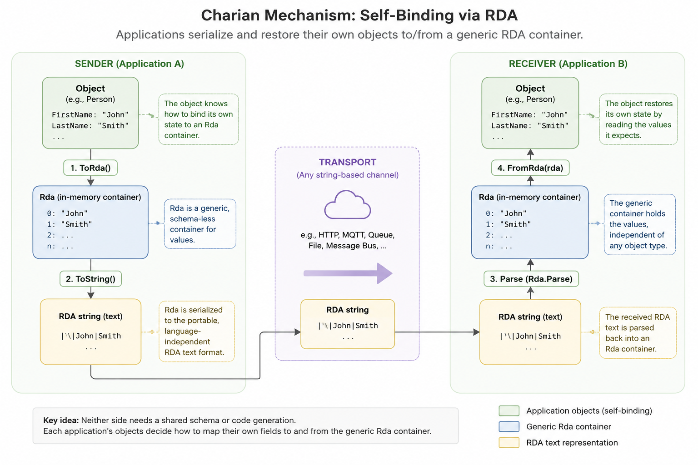

<!--- PROJECT SHIELDS --->

[![Contributors][contributors-shield]][contributors-url]
[![Forks][forks-shield]][forks-url]
[![Stargazers][stars-shield]][stars-url]
[![Issues][issues-shield]][issues-url]
[![GPL v3 License][license-shield]][license-url]

<div align="center">


**_"Schema-independent integration through application-controlled serialization."_**
</div>

<!--- TABLE OF CONTENTS --->
# Table of Contents

1. [What Is Charian](#what-is-charian)
   - [Serialization by self-binding](#serialization-by-self-binding)
   - [A simple example](#a-simple-example)
   - [When to use Charian](#when-to-use-charian)
2. [Getting Started](#getting-started)
   - [Installation](#installation)
   - [Example: serializing a simple data object](#example-serializing-a-simple-data-object)
3. [Using the Charian API](#using-the-charian-api)
   - [Class Rda — a generic data container](#class-rda--a-generic-data-container)
   - [Interface IRda — app-layer schema resolution](#interface-irda--app-layer-schema-resolution)
4. [Charian Use Cases](#charian-use-cases)
5. [License & Commercial Use](#license--commercial-use)
6. [Get Involved](#get-involved)

# What Is Charian

**Charian** (pronounced /ka-ri-en/) is a lightweight, dependency-free serialization library for instant cross-application communication. It is purpsoely designed for applications whose data models evolve independently.

Unlike Protocol Buffers, Avro, or JSON Schema, which require adopting to a complex framework for shared schema definitions, code generation, and schema-version management, Charian serialization uses application-controlled data-model resolution which provides these benefits:

- **No schema, no code gen** — no `.proto` or `.avsc` files, no code generation, and no schema registry to keep in sync.
- **Resilience to data-model changes** — a field added, removed, or reordered in a data model on one side does not break the other.
- **Multiple versions side by side** — the receiving application can dynamically choose which version to use.
- **Tiny footprint** — approximately 800 lines of code and zero third-party dependencies.

### Serialization by self-binding

Charian adopts an application-controlled data-model resolution pattern called **self-binding**, which can be explained using a moving-house analogy.

Imagine moving house. Furniture is disassembled, packed into boxes, transported, and then reassembled at the destination. The freight company never needs to know what is inside each box — that is the mover's job at both ends.

Charian works the same way: an object resolves and restores its own state directly against a shared, generic container at runtime[^1]. The container can be serialized into a portable, language-independent text format called [**Recursive Delimited Array (RDA)**](https://github.com/foldda/rda) for easy transport.

[^1]: This idea is borrowed from the established late-binding technique—deciding how data matches a type at runtime rather than at compile time—and is applied specifically to allowing an object to read and write itself from a shared, evolving data stream.

> _Self-binding_ means a data object decides how to map its own fields to and from the RDA container, instead of relying on an external schema or code generator.

Boxes = RDA containers; freight company = any string-based communication; assembling furniture = self-binding.

### A simple example

```csharp
Person person = new Person("John", "Smith");

// [sender] Serialize: person binds itself to an Rda object.
string text = person.ToRda().ToString();

// [receiver] Deserialize: person restores itself from values in an Rda object.
Person restored = new Person();
restored.FromRda(Rda.Parse(text));
```

`ToRda()` and `FromRda()` are all that is required to serialize a self-binding object in your application as an RDA string - 

```
|\|John|Smith
```

No schema files, code generation, or serialization attributes involved.

<div align="left">

</div>

### When to use Charian

[Comparing to **Protocol Buffers**, **Avro**, or similar technologies](docs/Why-Charian.md), choose **Charian** when:

- Your applications evolve independently.
- You integrate with third-party or legacy systems.
- Maintaining shared schemas, or multiple schema versions, has become difficult.
- Cross-language compatibility matters.
- You prefer explicit serialization logic over generated code.

# Getting Started

You can start using Charian in one of two ways: **install it as a package** (recommended for most users) or **include the source files directly** (useful if you want source-level transparency, need to target a framework not covered by the package, or prefer to avoid an external dependency).

## Installation

### Option 1: Install via package manager

**C# (NuGet)**

```bash
dotnet add package Foldda.Charian
```

Or via the Package Manager Console:

```powershell
Install-Package Foldda.Charian
```

Or add it directly to your `.csproj`:

```xml
<PackageReference Include="Foldda.Charian" Version="1.0.1" />
```

The package targets .NET 5.0, .NET Core 2.0, .NET Standard 2.0, and .NET Framework 4.6.1, so it should be compatible with most existing C# projects. View the package on [NuGet.org](https://www.nuget.org/packages/Foldda.Charian).

**Python / Java**

Python and Java packages have not yet been published to PyPI or Maven Central. For now, use the source-inclusion method below for these languages.

### Option 2: Include the source files directly

Charian has no third-party dependencies, so integrating it is as simple as downloading two source files from this repository and adding them to your project.

1. Download the source files for your language from this repository:
   - [C#](https://github.com/foldda/charian/tree/main/src/CSharp)
   - [Java](https://github.com/foldda/charian/tree/main/src/Java)
   - [Python](https://github.com/foldda/charian/tree/main/src/Python)
2. Add the files to your project.
3. Reference them as you would any other local source file; no additional configuration is required.

> **Tip:** You can use the test cases in this repository as examples of how to use Charian.

## Example: serializing a simple data object

This example shows how to serialize a `Person` class using Charian by implementing the `IRda` interface's self-binding `ToRda()` and `FromRda()` methods. These methods hide the class's internal data model, allowing a client to serialize and deserialize it with simple calls. The optional `SaveToFile()` and `ReadFromFile()` methods show how serialized data can be exchanged.

```csharp
public class Person : IRda
{
    public string FirstName = "John";
    public string LastName = "Smith";

    // Specify an allocated position in the RDA for each property.
    public enum RDA_INDEX : int
    {
        FIRST_NAME = 0,
        LAST_NAME = 1
    }

    // Store the class's properties in an Rda object.
    public virtual Rda ToRda()
    {
        var rda = new Rda();  // Create an RDA container.

        rda[(int)RDA_INDEX.FIRST_NAME].ScalarValue = this.FirstName;
        rda[(int)RDA_INDEX.LAST_NAME].ScalarValue = this.LastName;
        return rda;
    }

    // Restore the class's properties from an RDA container.
    public virtual IRda FromRda(Rda rda)
    {
        this.FirstName = rda[(int)RDA_INDEX.FIRST_NAME].ScalarValue;
        this.LastName = rda[(int)RDA_INDEX.LAST_NAME].ScalarValue;
        return this;
    }

    // Save this Person object to a file.
    public void SaveToFile(string filePath)
    {
        string encodedRdaString = this.ToRda().ToString();
        File.WriteAllText(filePath, encodedRdaString);
    }

    // Restore a Person object from a file.
    public static Person ReadFromFile(string filePath)
    {
        string encodedRdaString = File.ReadAllText(filePath);
        Rda rda = Rda.Parse(encodedRdaString);
        Person person = new Person();
        person.FromRda(rda);
        return person;
    }
}
```

**Takeaway:** The `Person` class, at the application layer, implements two methods. `ToRda()` stores the object's essential properties and state in an Rda container, while `FromRda()` restores that state to a `Person` object during deserialization. The container is converted to a string for transport through a simple process such as file transfer.

# Using the Charian API

As explained in the moving-house analogy, applications using Charian disassemble complex objects into generic RDA containers for transport, and the receiving application reconstructs—or binds—the objects after delivery. The Charian API's `Rda` class and `IRda` interface are designed to support these operations.

## Class Rda — a generic data container

The `Rda` class is modeled as a one-size-fits-all container for storing arbitrary data. It has a multidimensional space, with each dimension expanding automatically. Each storage location is uniquely addressed by an integer array index, and a client uses getter/setter methods to access a data item at a given address. An Rda container is the packing box in the moving-house analogy.

An Rda container supports two data types: a data item can be either a string or another Rda container object. Charian assumes that primitive data, such as an integer or a date, can be converted to a string, while composite data, such as a class or an array, can be stored as an Rda object by recursively decomposing it into less complex structures or primitive data items.

The `Rda` class also implements methods that convert itself to and from an [RDA string](https://github.com/foldda/rda), so it is also an RDA parser/encoder.

For the full method signatures and a worked example of encoding and decoding an RDA string, see [API.md](docs/API.md#class-rda--an-rda-encoderparser).

## Interface IRda — app-layer schema resolution

The `IRda` interface is where a data object applies the **self-binding** pattern when serialized. In `ToRda()`, a data object packs its properties and state into an Rda container; in `FromRda(Rda rda)`, the data object unpacks and restores its properties and state from values stored in an Rda container.

Self-binding moves property resolution into the object's own code rather than using a compiled schema or an external mapper that an application cannot adapt at runtime. The `Person` class implements these two methods in [Example: serializing a simple data object](#example-serializing-a-simple-data-object).

For an extended example showing how a more complex object with nested classes is packed and unpacked, and how to handle unexpected or evolving data during unpacking, see [API.md](API.md#interface-irda--app-layer-schema-resolution).

# Charian Use Cases

**Maintain compatibility.** As illustrated in the examples in [API.md](API.md), a `ComplexPerson` object can extend a `Person` object while remaining backward compatible. If some programs use `Person` while others use the evolved `ComplexPerson`, they can remain compatible when communicating over a network.

**Cross-language data exchange.** Because the schemaless RDA string is language- and system-neutral, it can serve as a data container for transferring data flexibly across languages and platforms. Connected programs can deposit and consume data items stored in an RDA container without being constrained by a fixed data model. Each program can handle data conversion and related exceptions in its own packing and unpacking operations.

For example, an RDA container packed by a Java program can contain the properties of a Java `Person`. A Python program can unpack those properties and use them to construct a Python `User` object, which may not have exactly the same properties as the Java `Person`. If an item is missing or conversion fails, the Python program can handle the exception—for example, by sending an alert or substituting a default value.

**Maintaining rich and diverse datasets in parallel.** RDA's unrestricted and recursive structure allows each Rda data item in a container to remain isolated. Multiple datasets, or different versions of the same dataset, can therefore be stored or sent in one container side by side, allowing the receiver to test and select the appropriate version.

# License & Commercial Use

Charian is open-source software released under the **GNU General Public License v3.0 (GPL-3.0)**.

This means you are free to use, modify, and redistribute Charian under the terms of the GPL.

## Commercial licensing

If you want to use Charian in a proprietary or closed-source product, or distribute it without the requirements of the GPL, a **commercial license** is available.

Commercial licensing offers:

- Permission for closed-source use.
- Legal clarity for enterprise environments.
- Optional support and long-term maintenance agreements.

For commercial licensing inquiries, please contact **contact@foldda.com**.

Open-source users are welcome and encouraged to use Charian under GPL-3.0.

# Get Involved

This project needs contributions in the following areas:

## Write parsers/encoders in more languages

RDA has a very simple encoding rule for programmers fluent in a given language. Supporting a new language would enable exponential growth in the number of cross-language and cross-platform applications that can interact and exchange data.

For example, a C library could enable IoT devices to consume RDA data. An RDA codec would have a very small footprint, making it suitable for embedding in IoT devices.

It would also be valuable to create a parser library for TypeScript that enables rendering RDA-encoded data in TypeScript web controls.

## Write test cases

Charian's API is relatively small, but additional test cases would make it more robust and benefit anyone using the free library.

## Write documentation

Richer documentation would help the Charian project explain novel concepts such as self-binding and demonstrate practical use cases for programmers and systems developers.

<!--- MARKDOWN LINKS & IMAGES --->
[contributors-shield]: https://img.shields.io/github/contributors/foldda/charian.svg?style=for-the-badge
[contributors-url]: https://github.com/foldda/charian/graphs/contributors
[forks-shield]: https://img.shields.io/github/forks/foldda/charian.svg?style=for-the-badge
[forks-url]: https://github.com/foldda/charian/network/members
[stars-shield]: https://img.shields.io/github/stars/foldda/charian.svg?style=for-the-badge
[stars-url]: https://github.com/foldda/charian/stargazers
[issues-shield]: https://img.shields.io/github/issues/foldda/charian.svg?style=for-the-badge
[issues-url]: https://github.com/foldda/charian/issues
[license-shield]: https://img.shields.io/github/license/foldda/charian.svg?style=for-the-badge
[license-url]: https://github.com/foldda/charian/blob/master/LICENSE.txt
[product-screenshot]: images/screenshot.png
